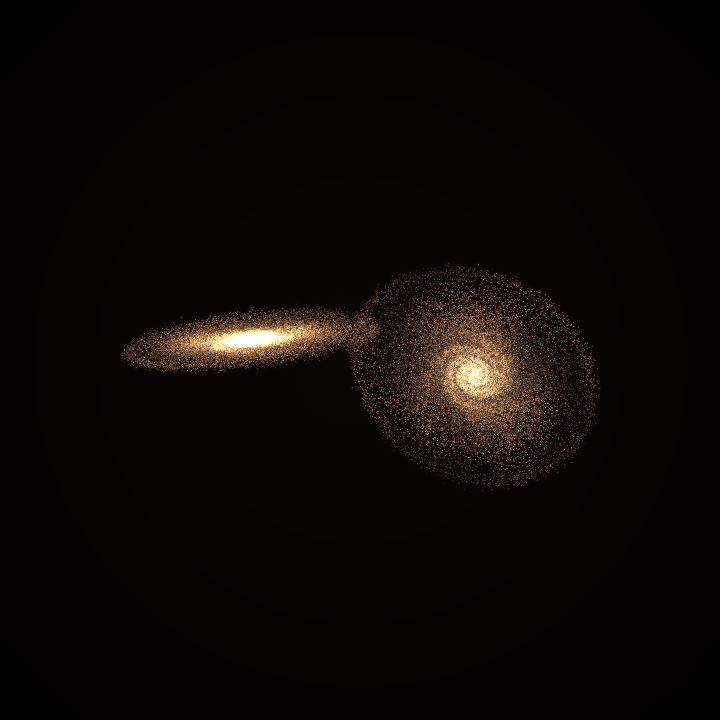
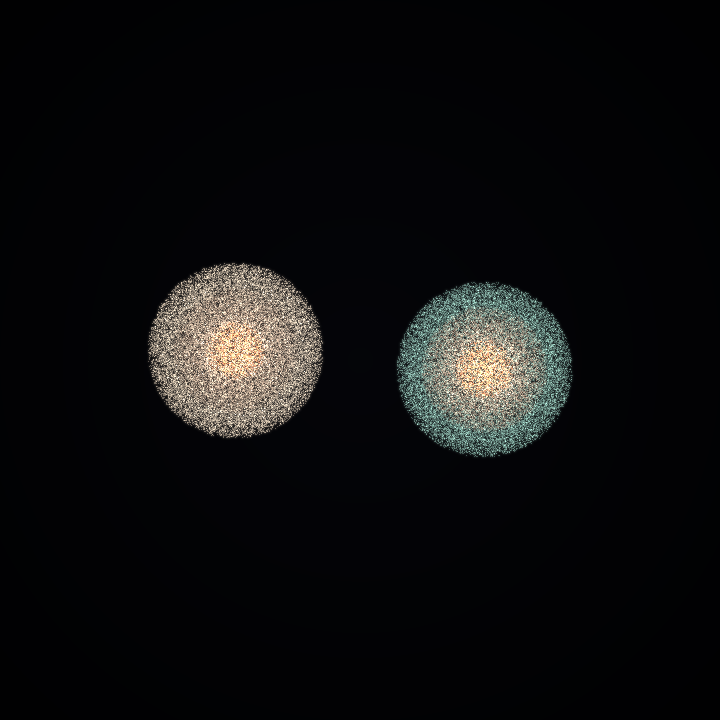
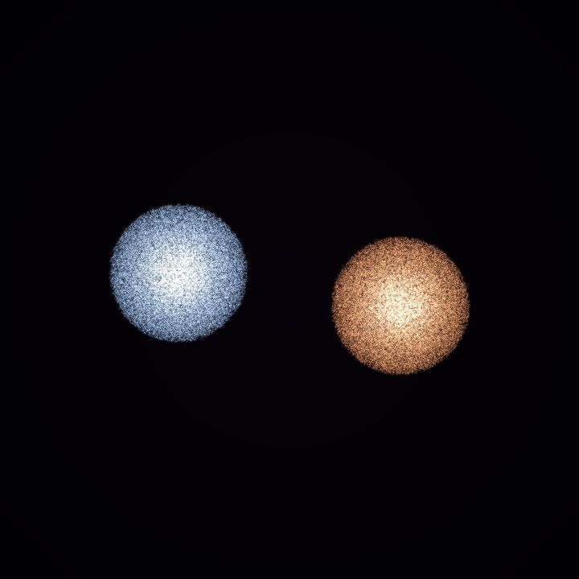

# TwinGalaxyNET

GPU-accelerated cosmic collision playground for dual-3090 machines: galaxy
mergers, rocky planet impacts, and stellar envelope collisions with cinematic
real-time visuals.

<p align="center">
  
  
  
</p>

## Modes

- `galaxy`: twin disk galaxy collision in kpc/Myr units.
- `planet`: two differentiated rocky bodies in Earth-radius/minute units.
- `star`: luminous stellar envelope collision in solar-radius/hour units.

## Physical Assumptions

- Galaxy mode uses collisionless stellar tracer particles in softened analytic
  galaxy potentials, following the spirit of restricted interaction experiments
  such as Toomre & Toomre (1972).
- Planet and star modes are deformable tracer-particle visual models, not full
  SPH or radiation-hydrodynamic solvers. They include center gravity, elastic
  restoring forces, impact heating, and debris/plasma plumes.
- The galaxy integrator uses a kick-drift-kick leapfrog scheme. Collider modes
  use semi-implicit particle updates for stable real-time visuals.
- Galaxy state uses `float64` by default because kpc/Myr dynamics spans large
  ranges. Render buffers and collider visuals use `float32` for speed.
- Explicit checks reject invalid time steps, negative scales, NaNs/Infs, and
  runaway particle speeds.
- Units are handled with `astropy` constants where physical conversions are
  needed, including center-of-mass speed readouts.

## Quick Start

```bash
cd /home/mtsu/projects/twingalaxynet
python3 -m venv .venv
source .venv/bin/activate
pip install -e ".[fast-display]"
twingalaxynet --display opencv
```

Without installing the package:

```bash
cd /home/mtsu/projects/twingalaxynet
PYTHONPATH=src python3 -m twingalaxynet --display opencv
```

## Favorite Commands

Galaxy collision:

```bash
PYTHONPATH=src python3 -m twingalaxynet \
  --mode galaxy \
  --display opencv \
  --renderer gpu \
  --theme jwst \
  --particles 90000 \
  --resolution 540
```

Planet collider:

```bash
PYTHONPATH=src python3 -m twingalaxynet \
  --mode planet \
  --display opencv \
  --particles 70000 \
  --resolution 480
```

Violent quick planet impact:

```bash
PYTHONPATH=src python3 -m twingalaxynet \
  --mode planet \
  --impact-speed 0.16 \
  --body-offset 1.7 \
  --particles 70000
```

Star collider:

```bash
PYTHONPATH=src python3 -m twingalaxynet \
  --mode star \
  --display opencv \
  --theme xray \
  --particles 90000 \
  --resolution 540
```

High-FPS mode:

```bash
PYTHONPATH=src python3 -m twingalaxynet \
  --display opencv \
  --renderer gpu \
  --particles 70000 \
  --resolution 480 \
  --no-bloom \
  --no-dust
```

MP4 export:

```bash
PYTHONPATH=src python3 -m twingalaxynet \
  --export-frames 600 \
  --export-mp4 collision.mp4 \
  --theme hubble \
  --auto-camera \
  --particles 90000 \
  --resolution 720
```

## Controls

OpenCV display, the default when available:

- `Space`: pause/play
- `W` / `S`: increase/decrease simulation speed
- `A` / `D`: rotate camera
- `[` / `]`: zoom out/in
- `P`: save a PNG into `renders/`
- `T`: cycle visual themes
- `C`: toggle cinematic auto-camera
- `R`: reset the simulation
- `Q` or `Esc`: quit

Matplotlib fallback with `--display matplotlib`:

- `Space`: pause/play
- `Up` / `Down`: increase/decrease simulation speed
- `Left` / `Right`: rotate camera
- `[` / `]`: zoom out/in
- `S`: save a PNG into `renders/`
- `T`: cycle visual themes
- `C`: toggle cinematic auto-camera
- `R`: reset the simulation
- `Q`: quit

## Visual Themes

- `natural`: balanced optical look with blue young stars and warm older stars.
- `hubble`: high-contrast optical palette.
- `jwst`: infrared-inspired red/gold dust and starburst look.
- `xray`: hot gas and energetic starburst styling.
- `plate`: old photographic survey plate style.

Realism layers are enabled by default:

- gas bridge emission between close-passing galaxies
- encounter-triggered nuclear and bridge starburst emission
- dust attenuation from projected density
- impact heating in rocky bodies
- plasma-like glow in stellar collisions
- bloom and asinh stretch for faint structure without blowing out cores

Disable expensive layers individually with `--no-bloom`, `--no-dust`,
`--no-gas`, or `--no-starburst`.

## Project Layout

```text
src/twingalaxynet/
  app.py          CLI, live display, exports
  simulation.py   galaxy encounter physics
  colliders.py    planet/star collider modes
  gpu_render.py   fast torch renderer for galaxy mode
  render.py       CPU renderer fallback
  themes.py       visual themes
scripts/
  smoke_test.py
  make_gallery.py
docs/images/
  gallery previews used in this README
```

## Generate Gallery Images

```bash
PYTHONPATH=src python3 scripts/make_gallery.py
```

## License

MIT. See [LICENSE](LICENSE).
